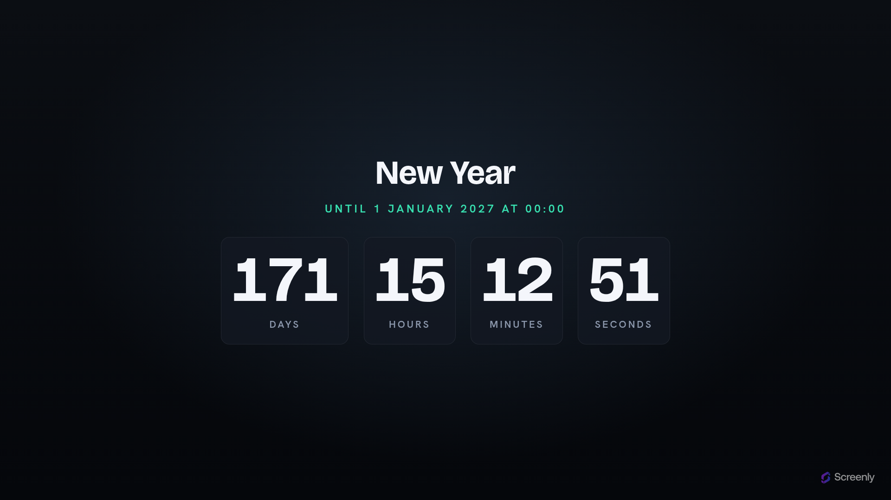

# Screenly Timer App

A full-screen **countdown / count-up** timer for digital signage. It ticks the
days, hours, minutes and seconds to a target instant — then keeps going and
counts **up** the elapsed time once the target passes. The same screen handles a
launch countdown *and* a "days since" board. Big tabular Bricolage Grotesque
numerals over a graphite ground with a single mint accent.



Live: **https://timer.srly.io**

Part of the Screenly signage family alongside the [quotes](../quotes),
[opening-hours](../opening-hours) and [world-clock](../world-clock) apps. Like
Quotes, this is a fully **static** site hosted on **GitHub Pages** — there's no
server; the clock ticks entirely in the browser. Like Opening Hours it takes
**settings**: the target arrives in the launch URL's query string, so one
deployment times any event.

## How it's configured

Everything is passed as query parameters:

```
https://timer.srly.io/?title=Product+Launch&target=2026-12-31T23:59:59&tz=Europe/London&message=We're+live!
```

| Param | Meaning |
| --- | --- |
| `target` | The moment to count to, ISO 8601 (`2026-12-31T23:59:59`). A **future** target counts down; a **past** one counts up. Include an offset (`…Z`, `…+02:00`) or set `tz`. |
| `title` | Optional heading above the clock, e.g. `Product Launch` or `Since Last Incident`. |
| `tz` | IANA time zone (e.g. `Europe/London`) used to read a `target` that has no offset of its own. Omitted, a zoneless target is read as UTC. |
| `message` | Optional line shown once the target is reached (during count-up), e.g. `Happy New Year!`. |

Opened with no parameters (e.g. the store preview), it counts down to a worked
example so the screen is never blank. There's no data to refresh — it's a single
self-ticking page.

## Direction is automatic

There's no mode to pick. The app compares the target to now on every tick:

- **before** the target → **counts down**, "Until {date}".
- **at / after** the target → **counts up**, "Since {date}", the numerals turn
  mint, and the optional `message` appears.

## Resolutions

Designed to look correct full-screen at common signage resolutions, both
orientations. One fluid root font-size (`clamp(vw + vh)`) drives the whole scale;
the four units sit on a row and wrap to 2×2 only when the viewport is too narrow.

| Resolution | Orientation |
| --- | --- |
| 1920×1080 | Landscape |
| 1080×1920 | Portrait |
| 3840×2160 | Landscape (4K) |
| 800×480 | Landscape (Raspberry Pi touch display) |

The numerals use tabular figures, so the width never jitters as the seconds tick.

## Development

Requires [Bun](https://bun.sh). Never npm/npx.

```sh
bun install     # deps; vendored fonts come from @fontsource via sync-fonts
bun run dev     # build + serve dist/ locally
bun run build   # assemble dist/ for GitHub Pages
bun test        # bun:test — date math + manifest validation
bun run typecheck
bun run lint
```

## How it's built

`build.js` assembles `dist/` without mutating sources: vendor fonts → copy
`index.html` + static assets + `.well-known` → compile & minify Tailwind → bundle
& minify the TypeScript → stamp a sha256 content hash into `?v=` asset URLs →
write `CNAME` (`timer.srly.io`). `dist/` is gitignored and is the artifact GitHub
Pages publishes.

Push to **`master`** and `.github/workflows/deploy-pages.yml` builds and deploys
to Pages. Pull requests run `ci.yml` (typecheck + lint + test + build). Action
versions are SHA-pinned.

## Licence

[AGPL-3.0-only](LICENSE).
